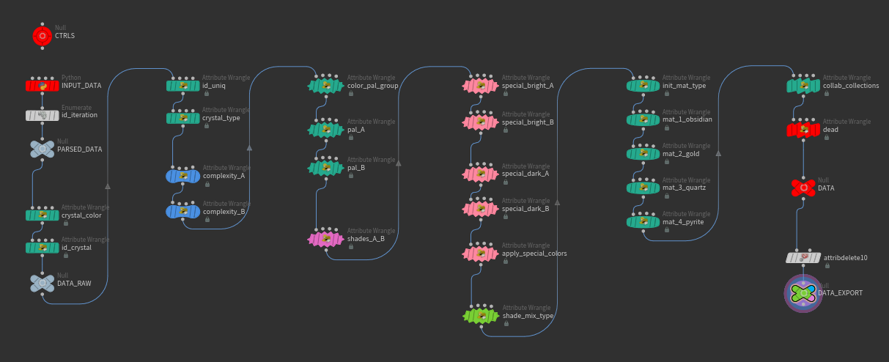

# OG:CR traits generation algortithm and data

OG:CR is a generative art project that consists of 10301 unique 3D crystals generated based on blockchain data. The following text describes how the traits are calculated from the raw data containing transactions list and wallets metadata. 

* **ogcr_traits_01_02.hip** - the traits scene file  was created, tested, and intendet to be used in **Houdini 18.5.633**. 
* **json_in_data.zip** - archive contains 10301 json files with all recorded from blockchain metadata needed to calculate each crystal's traits

<br>

Project website: [www.ogcrystals.com](https://www.ogcrystals.com/)

Collection on OpenSea: [opensea.io/collection/og-crystals](https://opensea.io/collection/og-crystals)

SideFX Houdini: [www.sidefx.com](https://www.sidefx.com/)

<br><br>


## Input data for each generated part of the crystal

<br>

**Balance_eth** - the amount of ETH the wallet holds

**Balance_nft** -  the number of NFTs the wallet holds

**Change_eth** - the difference between the current ETH amount and the amount 3 months ago

**Change_nft** - the difference between the current NFT number and the number 3 months ago

**Collection_name** - the list of 7 possible collab-collections if the wallet holds any of NFTs from these collections:
* 89 Seconds
* ArtBlocks
* BoredApes
* CryptoPunks
* Ksoids
* Meebits
* Omnimorphs

**Crystal_color** - the color group selected on minting:
* 0 - Red
* 1 - Yellow
* 2 - Green
* 3 - Blue
* 4 - Violet
* 5 - Neutral

**Floor** - the collection floor determined by OpenSea API at the moment of transaction

**Id_block** - the block number in the Ethereum blockchain in which the transaction was stored

**Id_crystal** - the crystal ID within the collection, 1-10301

**Id_iteration** - the generation number this part forms, 0 for Gen1 to 6 for Gen6

**Id_wallet** - a random number based on the wallet address

**Price** - the amount of ETH paid in the transaction

**Timestamp** - UTC timestamp of the transaction

**Transaction_num** - the total number of transactions made by the wallet

**Wallet** - the wallet address

<br><br>

## The traits generation algorithm

<br>



The parts of the algorithm are executed in the order of appearance in the document and each one may override traits set by the previous part. This means that Bright/Dark traits override regular color traits, special materials Obsidian/Gold/Quartz/Pyrite override Bright/Dark, collab-collection traits override special materials, and Dead trait overrides all of them.

<br>

#### id_uniq

Generate a unique ID for the crystal part based on Crystal ID, Block Number, Wallet Address, Timestamp.

```
//generate uniq ID for the crystal part based on Crystal ID, 
//Block Number, Wallet Address, Timestamp

@id_uniq = floor(rand(@id_crystal*0.2)*100000);
@id_uniq += floor(rand(@id_block*0.3)*100000); 
@id_uniq += floor(rand(@id_wallet*0.4)*100000);
@id_uniq += floor(rand(@timestamp*0.5)*100000);
```

<br>

#### crystal_type

By default Spiky, Fractal, Cluster and Coral types have equal probabilities with 10% in favor of Coral. 

The type can be changed then and the probability of this is based on the absolute change in NFT count owned by the wallet - 10% for 3-10 change, 20% for 10-50, and 30% for more than 50. If the probability is met the type will be replaced by random angular type (Spiky, Fractal, or Cluster) for the positive NFT count change and by random Coral type for negative ones.

After that for 8% of Crystal IDs and 5% Wallet IDs, the crystal type may be replaced by a constant determined by Crystal ID or Wallet ID respectively, creating crystals that have all parts of the same type and wallets that create only one particular type of crystal part.

```
//set max available types
int max_type = 6;

//by default set crystal as random type by uniq_ID with equal probs
i@type = floor(rand(@id_uniq*7.11)*10000) % 4;

//additional 10% of corals
if(rand(@id_uniq*17.12)<0.07) i@type = 3;

//if it is a coral divide it to 3 subtypes
if(i@type==3) i@type = 3 + (floor(rand(@id_uniq*18.68)*10000) % 3);

    
//set probability of changing type to 0
float prob = 0;

//absolute amount of nft count change
float abs_change_nft = abs(@change_nft);

//set probability of changing type base on change in nft count
if(abs_change_nft>3 && abs_change_nft<=10) prob = 0.1;
else if(abs_change_nft>10 && abs_change_nft<=50) prob = 0.2;
else if(abs_change_nft>50) prob = 0.3;

//if probability is met change type to 0-1-2 for positive nft change or 3-4-5 for negative
if(rand(@id_uniq*8.66)<prob) {
    if(@change_nft>0) i@type = floor(rand(@id_uniq*8.67)*10000) % 3;
    else i@type = 3 + (floor(rand(@id_uniq*8.68)*10000) % 3);
}


//override type for rare crystals by crystal ID and wallet
//get probabilities of constant shape crystals by crystal ID and wallet
float const_type_crystal = chf("const_type_crystal");
float const_type_wallet = chf("const_type_wallet");

//rare crystals have constant type defined by crystal ID
if(rand(@id_crystal*7.13)<const_type_crystal) 
    i@type = floor(rand(@id_crystal*7.14)*10000) % max_type;

//rare crystals have constant type defined by wallet
if(rand(@id_wallet*7.15)<const_type_wallet) 
    i@type = floor(rand(@id_wallet*7.16)*10000) % max_type;
```

<br>

#### complexity_A and complexity_B

Generates parameters that determine the shape/density/size of each crystal part. 20% of the parts have this parameter set to random base on the id_uniq attribute. 80% have the parameter mapped from the number of transactions made by each particular wallet.

```
// for 20% of parts set complexity to random value
if(rand(@id_uniq*24.23)<0.2) {
    @complexity_A = fit01(rand(@id_uniq*24.24),0,1);    
}
// for 80% of parts complexity is based on transaction number
else {
    // number of tranasctions is mapped to complexity
    @complexity_A = fit(@transaction_num,0,250,0,1);
    // 20% random shift added
    @complexity_A += 0.2 * fit01(rand(@id_uniq*24.25),-1,1);
    
    @complexity_A = clamp(@complexity_A,0,1);
}    
```
```
// for 20% of parts set complexity to random value
if(rand(@id_uniq*25.23)<0.2) {
    @complexity_B = fit01(rand(@id_uniq*25.24),0,1);    
}
// for 80% of parts complexity is based on transaction number
else {
    // number of tranasctions is mapped to complexity
    @complexity_B = fit(@transaction_num,0,250,0,1);
    // 20% random shift added
    @complexity_B += 0.2 * fit01(rand(@id_uniq*25.25),-1,1);
    
    @complexity_B = clamp(@complexity_B,0,1);
}    
```

<br>

#### color_pal_group

For the Gen1 part, the color is set to one chosen on minting for the whole crystal.

For the next generation parts in 25% crystal IDs and 5% wallet IDs the color remains the same creating constant color crystals based on crystal ID and wallet ID respectively. In all other cases, the color is selected randomly based on the id_uniq attribute.

```
float const_color_crystal = chf("const_color_crystal");
float const_color_wallet = chf("const_color_wallet");

int const_color = 0;

//set pal by user choice
//i@pal_group = chi("color_pref");
i@pal_group = int(@crystal_color);


// choose pal for all iterations above 0
if(@id_iteration > 0) {
    //constant color crystal by crystal ID and wallet ID
    if(rand(@id_crystal*1.13)<const_color_crystal) const_color = 1;
    if(rand(@id_wallet*1.14)<const_color_wallet) const_color = 1;

    //for rare constant colors don't change the base pal, for all others make a random one
    if(const_color==0) {
        i@pal_group = int(rand(@id_uniq*1.15)*1000)%6;
    }
}
```

<br>

#### pal_A 

Selects color pallet files based on the color_pal_group that will be used for color sampling for the crystal primary color.

```
//select pal file based on pal_group attribute
s@pal_A = "pal_01_red";
if(i@pal_group==1) s@pal_A="pal_01_yellow";
else if(i@pal_group==2) s@pal_A="pal_01_green";
else if(i@pal_group==3) s@pal_A="pal_01_blue";
else if(i@pal_group==4) s@pal_A="pal_01_violet";
else if(i@pal_group==5) s@pal_A="pal_01_neutral";

s@pal_A = "$HIP/pic/" + s@pal_A + ".png";
```

<br>

#### pal_B 

Selects color pallet files for the secondary color. For 80% of crystal parts, the secondary color palette is the same as the primary one. For the rest 20% the secondary palette is selected randomly.

```
//random pal_B file based on id_uniq

float seed = @id_uniq*0.143;
int pal_group_B = floor(rand(seed*0.92)*10000)%6;

string pal = "pal_01_red";

if(pal_group_B==1) pal="pal_01_yellow";
else if(pal_group_B==2) pal="pal_01_green";
else if(pal_group_B==3) pal="pal_01_blue";
else if(pal_group_B==4) pal="pal_01_violet";
else if(pal_group_B==5) pal="pal_01_neutral";


s@pal_B = "$HIP/pic/" + pal + ".png";

// 80% of crystals have secondary color from the same pal
if(rand(@id_uniq*0.144)<0.80)
    s@pal_B = s@pal_A;
```

<br>

#### shades_A_B

Samples bright-mid-dark color triplets from random color sets within the selected color palette. Then creates a gradient based on these colors and then samples the primary crystal color from the random part of the gradient. Repeats the same process for the secondary color.

```
//choose random vertical position in pal for A and B colors
float uv_A_y = rand(@id_uniq*0.111);
float uv_B_y = rand(@id_uniq*0.112);

//sample bright / med / dark colors from selected row in pal_A
vector color_A1 = colormap(s@pal_A,set(0.25,uv_A_y,0));
vector color_A2 = colormap(s@pal_A,set(0.50,uv_A_y,0));
vector color_A3 = colormap(s@pal_A,set(0.75,uv_A_y,0));

//sample bright / med / dark colors from selected row in pal_B
vector color_B1 = colormap(s@pal_B,set(0.25,uv_B_y,0));
vector color_B2 = colormap(s@pal_B,set(0.50,uv_B_y,0));
vector color_B3 = colormap(s@pal_B,set(0.75,uv_B_y,0));

//random color positions in gradients
// main color around the center of gradient
// second color anywhere in gradient
float pos_A = fit01(rand(@id_uniq*0.113),0.35,0.65);
float pos_B = fit01(rand(@id_uniq*0.114),0.00,1.00);

//sample colors from gradients
v@shade_A = lspline(pos_A,color_A1,color_A2,color_A3);
v@shade_B = lspline(pos_B,color_B1,color_B2,color_B3);
```

<br>

#### special_bright_A and special_bright_B

The chance of having the Bright trait is set to 0.1% by default. For 2% of crystal IDs and 2% of wallet IDs, the chance is changed to 99%. For the rest additional chance is added based on the change in ETH amount the wallet holds (only positive change counts) - +2% for 0.1-2.5 ETH, +4% for 2.5-10 ETH, and +12% for more than 10 ETH. The same process is applied for both primary and secondary colors.

```
// init special bright attribute to 0
i@shade_A_bright = 0;

//init the chance of special bright to 0.01%
float prob = 0.001;

//get global probabilities of special bright color by crystal ID and wallet
float prob_bright_crystal = chf("prob_bright_crystal");
float prob_bright_wallet = chf("prob_bright_wallet");

//set prob to 1 for lucky crystals and wallets
if(rand(@id_crystal*2.13)<prob_bright_crystal) prob = 0.999;
if(rand(@id_wallet*2.14)<prob_bright_wallet) prob = 0.999;

//alternatively additional probabilities based on change_eth amount
if(@change_eth > 0.1 && @change_eth <= 2.5) prob += 0.02;
else if(@change_eth > 2.5 && @change_eth <= 10) prob += 0.04;
else if(@change_eth > 10) prob += 0.12;

prob = clamp(prob,0,1);

//update attributes and change shade_A and/or shade_B
if(rand(@id_uniq * 2.15) < prob) {
    i@shade_A_bright = 1;
//    v@shade_A = lerp(v@shade_A,1,0.7);
}
```
```
// init special bright attribute to 0
i@shade_B_bright = 0;

//init the chance of special bright to 0.01%
float prob = 0.001;

//get global probabilities of special bright color by crystal ID and wallet
float prob_bright_crystal = chf("prob_bright_crystal");
float prob_bright_wallet = chf("prob_bright_wallet");

//set prob to 1 for lucky crystals and wallets
if(rand(@id_crystal*2.131)<prob_bright_crystal) prob = 0.999;
if(rand(@id_wallet*2.141)<prob_bright_wallet) prob = 0.999;

//alternatively additional probabilities based on change_eth amount
if(@change_eth > 0.1 && @change_eth <= 2.5) prob += 0.02;
else if(@change_eth > 2.5 && @change_eth <= 10) prob += 0.04;
else if(@change_eth > 10) prob += 0.12;

prob = clamp(prob,0,1);

//update attributes and change shade_A and/or shade_B
if(rand(@id_uniq * 2.151) < prob) {
    i@shade_B_bright = 1;
//    v@shade_B = lerp(v@shade_B,1,0.7);
}
```

<br>

#### special_dark_A and special_dark_B

The chance of having the Dark trait is set to 0.1% by default. For 2.5% of crystal IDs and 2.5% of wallet IDs, the chance is changed to 99%. For the rest additional chance is added based on the change in ETH amount the wallet holds (only negative change counts) - +5% for - 0.1 to -2.5 ETH, +10% for -2.5 to -10 ETH, and +20% for more than 10 ETH lost. The same process is applied for both primary and secondary colors.

```
// init special dark attribute to 0
i@shade_A_dark = 0;

//init the chance of special dark to 0.01%
float prob = 0.001;

//get global probabilities of special dark color by crystal ID and wallet
float prob_dark_crystal = chf("prob_dark_crystal");
float prob_dark_wallet = chf("prob_dark_wallet");

//set prob to 1 for luck crystals and wallets
if(rand(@id_crystal*3.13)<prob_dark_crystal) prob = 0.999;
if(rand(@id_wallet*3.14)<prob_dark_wallet) prob = 0.999;

//alternatively additional probabilities based on change_eth amount
if(@change_eth < -0.1 && @change_eth >= -2.5) prob += 0.05;
else if(@change_eth < -2.5 && @change_eth >= -10) prob += 0.1;
else if(@change_eth < -10) prob += 0.2;

prob = clamp(prob,0,1);

//update attributes and change shade_A and/or shade_B
if(rand(@id_uniq * 3.15) < prob) {
    i@shade_A_dark = 1;
//    v@shade_A = lerp(v@shade_A,0,0.8);
}
```
```
// init special dark attribute to 0
i@shade_B_dark = 0;

//init the chance of special dark to 0.01%
float prob = 0.001;

//get global probabilities of special dark color by crystal ID and wallet
float prob_dark_crystal = chf("prob_dark_crystal");
float prob_dark_wallet = chf("prob_dark_wallet");

//set prob to 1 for luck crystals and wallets
if(rand(@id_crystal*3.131)<prob_dark_crystal) prob = 0.999;
if(rand(@id_wallet*3.141)<prob_dark_wallet) prob = 0.999;

//alternatively additional probabilities based on change_eth amount
if(@change_eth < -0.1 && @change_eth >= -2.5) prob += 0.05;
else if(@change_eth < -2.5 && @change_eth >= -10) prob += 0.1;
else if(@change_eth < -10) prob += 0.2;

prob = clamp(prob,0,1);

//update attributes and change shade_A and/or shade_B
if(rand(@id_uniq * 3.151) < prob) {
    i@shade_B_dark = 1;
//    v@shade_B = lerp(v@shade_B,0,0.8);
}
```

<br>

#### apply_special_colors

Changes primary and secondary colors to a Bright/Dark version if the part got these traits.

```
if(i@shade_A_bright == 1) {
    v@shade_A = lerp(v@shade_A,1,0.7);
    i@shade_A_dark = 0;
}    
else if(i@shade_A_dark == 1) {
    v@shade_A = lerp(v@shade_A,0,0.8);
}


if(i@shade_B_bright == 1) {
    v@shade_B = lerp(v@shade_B,1,0.7);
    i@shade_B_dark = 0;
}    
else if(i@shade_B_dark == 1) {
    v@shade_B = lerp(v@shade_B,0,0.8);
}    
```

<br>

#### shade_mix_type

Randomly selects one of 5 possible mixing types that define the pattern used to mix primary and secondary colors on the crystal surface

```
float seed = @id_uniq*0.3211;

i@shade_mix_type = floor(rand(seed)*10000)%5;
```

<br>

#### mat_1_obsidian

Determines if the part has the Obsidian trait, by default the chance is 0. 

For 0.5% of the crystal parts, 1% of crystal IDs, and 1% of wallet IDs the chance is increased by 99.95% - representing “pure” luck and lucky crystals and wallets. An additional chance is added based on the number of NFTs the wallet holds - starting from 2% for 0 NFTs to 0.1% for 100 NFTs and more. Meaning the fewer NFTs the wallet holds the higher chance to get the Obsidian trait.

```
//generate seeds based on id_uniq, wallet id, and crystal id
float seed_mat = @id_uniq * 1.5211;
float seed_wallet = @id_wallet * 1.5212;
float seed_crystal = @id_crystal * 1.5213;

//get probabilities based on id_uniq, wallet id, and crystal id
float prob_mat = chf("prob_mat");
float prob_wallet = chf("prob_wallet");
float prob_crystal = chf("prob_crystal");

// set material override probability to 0
float set_mat_prob = 0;

// check 3 probabilities
if(rand(seed_mat)<prob_mat) set_mat_prob = 0.9995;
if(rand(seed_wallet)<prob_wallet) set_mat_prob = 0.9995;
if(rand(seed_crystal)<prob_crystal) set_mat_prob = 0.9995;


set_mat_prob += fit(@balance_nft,0,100,0.02,0.001);
set_mat_prob = clamp(set_mat_prob,0,1);

if( rand(@id_uniq*1.5214) < set_mat_prob ) i@mat_type = 1;
```

<br>

#### mat_2_gold

Determines if the part has the Gold trait, by default the chance is 0. 

For 0.5% of the crystal parts, 1% of crystal IDs, and 1% of wallet IDs the chance is increased by 99.95% - representing “pure” luck and lucky crystals and wallets. An additional chance is added based on the amount of ETH the wallet holds - starting from 2% for 0 ETH to 0.1% for 15 ETH and more. Meaning the fewer ETH the wallet holds the higher chance to get the Gold trait.

```
//generate seeds based on id_uniq, wallet id, and crystal id
float seed_mat = @id_uniq * 2.5211;
float seed_wallet = @id_wallet * 2.5212;
float seed_crystal = @id_crystal * 2.5213;

//get probabilities based on id_uniq, wallet id, and crystal id
float prob_mat = chf("prob_mat");
float prob_wallet = chf("prob_wallet");
float prob_crystal = chf("prob_crystal");

// set material override probability to 0
float set_mat_prob = 0;

// check 3 probabilities
if(rand(seed_mat)<prob_mat) set_mat_prob = 0.9995;
if(rand(seed_wallet)<prob_wallet) set_mat_prob = 0.9995;
if(rand(seed_crystal)<prob_crystal) set_mat_prob = 0.9995;


set_mat_prob += fit(@balance_eth,0,15,0.02,0.001);
set_mat_prob = clamp(set_mat_prob,0,1);

if( rand(@id_uniq*2.5214) < set_mat_prob ) i@mat_type = 2;
```

<br>

#### mat_3_quartz

Determines if the part has the Quartz trait, by default the chance is 0. 

For 1% of the crystal parts, 1% of crystal IDs, and 1% of wallet IDs the chance is increased by 99.95% - representing “pure” luck and lucky crystals and wallets. An additional chance is added based on the number of NFTs the wallet holds - starting from 2% for 100 NFTs to 0.1% for 0 NFTs. Meaning the more NFTs the wallet holds the higher chance to get the Quartz trait.

```
//generate seeds based on id_uniq, wallet id, and crystal id
float seed_mat = @id_uniq * 3.5211;
float seed_wallet = @id_wallet * 3.5212;
float seed_crystal = @id_crystal * 3.5213;

//get probabilities based on id_uniq, wallet id, and crystal id
float prob_mat = chf("prob_mat");
float prob_wallet = chf("prob_wallet");
float prob_crystal = chf("prob_crystal");

// set material override probability to 0
float set_mat_prob = 0;

// check 3 probabilities
if(rand(seed_mat)<prob_mat) set_mat_prob = 0.9995;
if(rand(seed_wallet)<prob_wallet) set_mat_prob = 0.9995;
if(rand(seed_crystal)<prob_crystal) set_mat_prob = 0.9995;


set_mat_prob += fit(@balance_nft,100,0,0.02,0.001);
set_mat_prob = clamp(set_mat_prob,0,1);

if( rand(@id_uniq*3.5214) < set_mat_prob ) i@mat_type = 3;
```

<br>

#### mat_4_pyrite

Determines if the part has the Pyrite trait, by default the chance is 0. 

For 1% of the crystal parts, 1% of crystal IDs, and 1% of wallet IDs the chance is increased by 99.95% - representing “pure” luck and lucky crystals and wallets. An additional chance is added based on the amount of ETH the wallet holds - starting from 2% for 15 ETH to 0.1% for 0 ETH. Meaning the more ETH the wallet holds the higher chance to get the Pyrite trait.

```
//generate seeds based on id_uniq, wallet id, and crystal id
float seed_mat = @id_uniq * 4.5211;
float seed_wallet = @id_wallet * 4.5212;
float seed_crystal = @id_crystal * 4.5213;

//get probabilities based on id_uniq, wallet id, and crystal id
float prob_mat = chf("prob_mat");
float prob_wallet = chf("prob_wallet");
float prob_crystal = chf("prob_crystal");

// set material override probability to 0
float set_mat_prob = 0;

// check 3 probabilities
if(rand(seed_mat)<prob_mat) set_mat_prob = 0.9995;
if(rand(seed_wallet)<prob_wallet) set_mat_prob = 0.9995;
if(rand(seed_crystal)<prob_crystal) set_mat_prob = 0.9995;


set_mat_prob += fit(@balance_eth,15,0,0.02,0.001);
set_mat_prob = clamp(set_mat_prob,0,1);

if( rand(@id_uniq*4.5214) < set_mat_prob ) i@mat_type = 4;
```

<br>

#### collab_collections

If the wallet holds any NFTs from the 7 supported collab-collections there is a 33% chance to get a special collab trait. If the wallet has NFTs from more than one supported collection the collab trait is selected randomly between the present collections. Meaning if the wallet has only one supported collection there is a 33% chance to get this collab trait. If the wallet has NFTs from 2 collections there is a 33/2=16.5% chance of getting each of two, etc.

```
i[]@list_type;
i[]@list_mat;

int check_1 = find(s@collection_name,"/ksoids/");
int check_2 = find(s@collection_name,"/boredApes/");
int check_3 = find(s@collection_name,"/meebits/");
int check_4 = find(s@collection_name,"/omnimorphs/");
int check_5 = find(s@collection_name,"/89seconds/");
int check_6 = find(s@collection_name,"/artBlocks/");
int check_7 = find(s@collection_name,"/cryptoPunks/");

if(check_1 >= 0) { push(@list_type, 6); push(@list_mat, 101);}
if(check_2 >= 0) { push(@list_type, 7); push(@list_mat, 102);}
if(check_3 >= 0) { push(@list_type, 8); push(@list_mat, 103);}
if(check_4 >= 0) { push(@list_type, 9); push(@list_mat, 104);}
if(check_5 >= 0) { push(@list_type, 10); push(@list_mat, 105);}
if(check_6 >= 0) { push(@list_type, 11); push(@list_mat, 106);}
if(check_7 >= 0) { push(@list_type, 12); push(@list_mat, 107);}

i@type_special = 0;

float spec_prob = chf("prob");

if(rand( @id_uniq*184.222)<spec_prob && len(@list_type)>0 ) {
    int max = len(@list_type);
    int collection = floor(rand(@id_uniq*185.222)*10000)%max;
    
    i@type_special = 1;
    @type = @list_type[collection];
    @mat_type = @list_mat[collection];
} 
```

<br>

#### dead

If the crystal was sold below the current floor price there is a chance of getting Dead trait - from 0% for selling 15% lower than the floor price to 99% for selling 85% lower than the floor.

```
int dead = 0;

if(@price < @floor) {
    float d = (@floor - @price) / @floor;
    
    d = fit(d, 0.15, 0.85, 0, 1);
    d = chramp("ramp", d);
 
    if(rand(@id_uniq*13.13)<d) dead = 1;
}

if(dead==1) {
    i@type_special = 1;
    i@type = 13;
    i@mat_type = 201;
}
```

<br><br>

## Raw output data for each generated part of the crystal

<br>

**Mat_type** - the material of the part

**Pal_group** - the color group 

**Shade_A_bright** - the flag for Bright primary color

**Shade_B_dark** - the flag for Dark primary color

**Type** - the type of the crystal part

**Type_Special** - the flag of special types of the crystal part

<br><br>

## How the traits are generated out of the raw output

<br>

Each crystal part has a trait from the Shape group. Some parts have additional traits from the Material group. All parts are treated equally independently of the order they are created. So the algorithm generates all the necessary traits for each part and then counts the number of appearances of the same trait within the crystal and that number is written into the metadata.

For each crystal part, the Shape group trait is defined by the Type attribute:
* 0 - Spiky 
* 1 - Cluster
* 2 - Fractal
* 3 - Coral
* 4 - Coral
* 5 - Coral
* 6 - Ksoid
* 7 - BAYC
* 8 - Meebit
* 9 - Omnimorph
* 10 - 89 Seconds
* 11 - Art Block
* 12 - Cryptopunk
* 13 - Dead

<br>

For each crystal part, the Material group trait is defined by the following algorithm:

1. If Type_special equals 1, then the Material is defined by the Shape and there is no need to output the material trait 

2. If Type_special equals 0

  2.1. If Mat_type equals 0, then the Material is defined by the Pal_type
  * 0 - Red 
  * 1 - Yellow
  * 2 - Green
  * 3 - Blue
  * 4 - Violet
  * 5 - Neutral

  2.2. If Mat_type equals 0 and Shade_A_bright equals 1, then the Material is Bright

  2.3. If Mat_type equals 0 and Shade_A_dark equals 1, then the Material is Dark

  2.4. If Mat_type is greater than 0 it defines the Material according to the list:
  * 1 - Obsidian
  * 2 - Gold
  * 3 - Quartz
  * 4 - Pyrite

<br>

For example, if the crystal consists of 4 parts: 2 of which are Red, 1 is Green, 3 are Fractal type and 1 is BAYC collab, the resulting traits will be - Generation: 4, Red: 2, Green: 1, Fractal: 3, BAYC: 1
